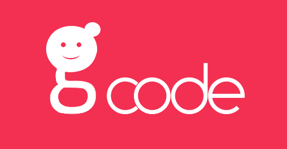

<!DOCTYPE html>
 <html>
 <head>
   <title></title>
   
 </head>
 <body>
    

      

        </img>
        <h1>GirlsCode IT</h1>
      

      <h3>What?</h3>
      
Uno spazio fornito da XPeppers per donne e ragazze che hanno voglia di muovere i loro primi passi nel mondo della programmazione, e per programmatrici già formate che hanno bisogno di supporto.
       
      Oppure, semplicemente, per chi ha voglia di fare due chiacchiere sulle gioie e i dolori dell'essere una ragazza nell'ambito dell'informatica.

      

      <h3>When?</h3>
      
Ogni martedì, dalle 18:00 alle 20:00.

      

      <h3>Where?</h3>
      
Nella sede di XPeppers Trento: Piazza di Centa 7.

      

      <h3>How?</h3>
      
Ogni incontro sarà a sé stante e non intende essere una formazione completa sugli argomenti affrontati.
      Ci focalizzeremo piuttosto su un topic tecnico particolare in ogni serata con un approccio hands-on sul codice per chi sta imparando, cercando di produrre degli esempi di piccole applicazioni funzionanti con cui poter elaborare e sperimentare anche a casa.
      Gli esercizi saranno tarati mano a mano sul livello tecnico delle partecipanti.
      Per chi invece già programma e vorrebbe seguire un proprio progetto personale offriremo supporto e consulenza.
      Ma, soprattutto, tutto questo avverrà in un ambiente sicuro in cui poter socializzare e condividere le proprie esperienze.

      Le partecipanti dovranno essere munite di un pc personale per partecipare alle attività pratiche.

      

      <h3>Why?</h3>
      
Perché un incontro per sole donne?

      Perché le donne sono una delle categorie più sotto rappresentate nel mondo dell'informatica, quindi speriamo nel nostro piccolo di riuscire ad invogliarle a sperimentare con il codice e, magari, perseguire una carriera come programmatrici.
      Vogliamo coinvolgere anche e soprattutto chi proviene da un brackground completamente diverso, non ha mai considerato questa materia o l'ha abbandonata dopo essersi confrontata con il sistema scolastico o lavorativo.

      

        <h3>Tutors</h3>
        

          

            </img>
            
Erinda Jaupaj

          

          

            </img>
            
Valentina Servile

          

        

      

      

        

          <a class="b_register" href="">Registrati al nostro prossimo evento</a>
        

      

    

 </body>
 </html>
